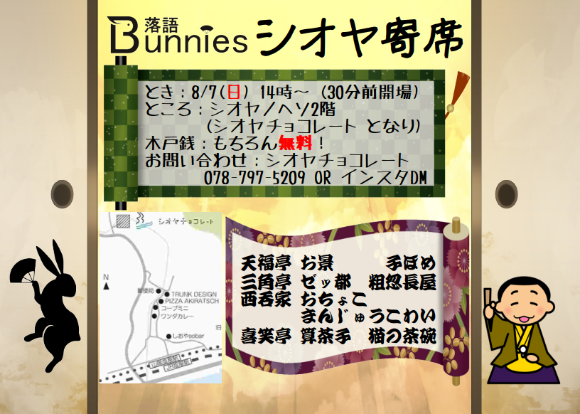

# 過去の公演

## 【中止になりました】シオヤ寄席

* とき：2022年8月7日 14:00〜 
* ところ：シオヤノヘソ 2階　(地図は [こちら](https://www.google.com/maps/place/%E3%80%92655-0872+%E5%85%B5%E5%BA%AB%E7%9C%8C%E7%A5%9E%E6%88%B8%E5%B8%82%E5%9E%82%E6%B0%B4%E5%8C%BA%E5%A1%A9%E5%B1%8B%E7%94%BA%EF%BC%94%E4%B8%81%E7%9B%AE%EF%BC%91%EF%BC%90%E2%88%92%EF%BC%91%EF%BC%91/@34.6373036,135.0788427,17z/data=!3m1!4b1!4m5!3m4!1s0x6000847bbd1e6ab3:0x4c6a79ad3a434b6c!8m2!3d34.6373036!4d135.0810314))

## 落語バニーズミニ・お試しオンライン

* ところ：[Youtube](https://youtu.be/r1fyQAO4QkQ)にて配信します。URLは [https://youtu.be/r1fyQAO4QkQ](https://youtu.be/r1fyQAO4QkQ)

## 第2回落語バニーズの会

* とき：2020年1月12日 13:30〜 (15分前開場)　上演時間2時間45分予定(途中休憩あり）
* ところ：[新長田勤労市民センター](https://www.kobe-kinrou.jp/shisetsu/shinnagata/) 4階 和室
  * JR/神戸市営地下鉄新長田駅南口すぐ
* 木戸銭：もちろん*無料*

## もしもしBunnies東西交流会

*10月13日 東京会場の開催は、台風の影響を鑑み、中止といたします。*

東京「もしもし亭」と神戸「落語Bunnies」が交流・共演する落語会！
* とき：2019年11月3日 13:30〜 (15分前開場)　16:30頃終演予定(途中休憩あり）
* ところ：[モンプレジール](http://1988monplaisir.fun/)　(兵庫県西宮市甲子園口2丁目16番21号)
  * JR神戸線 甲子園口駅 徒歩5分
* 木戸銭：もちろん*無料*

## 第1回落語バニーズの会

* とき：2019年1月13日 13:30〜 (15分前開場)　上演時間2時間45分予定(途中休憩あり）
* ところ：[新長田勤労市民センター](https://www.kobe-kinrou.jp/shisetsu/shinnagata/) 4階 和室
  * JR/神戸市営地下鉄新長田駅南口すぐ
* 木戸銭：もちろん*無料*
