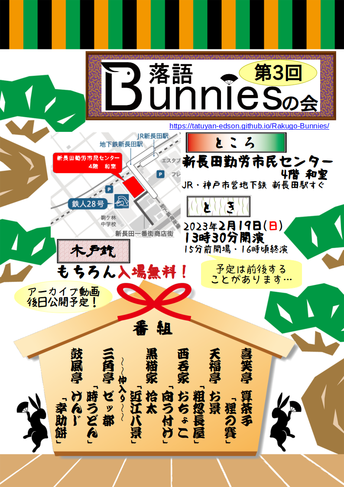

# 最新の公演情報

** 終了いたしました。お運びありがとうございました！**

* とき：2023年2月19日 13:30〜 (15分前開場)　16時頃終演予定(途中休憩あり）
* ところ：[新長田勤労市民センター](https://www.kobe-kinrou.jp/shisetsu/shinnagata/) 4階 和室
  * JR/神戸市営地下鉄新長田駅南口すぐ
* 木戸銭：もちろん*無料*
* [アーカイブを公開いたしました。機材の都合上、音質が悪くご不便をおかけいたします旨、お詫び申し上げます。](https://youtube.com/playlist?list=PLvqA8nD_0MQAhLZ_Q0Imd0Cp8WAX04Kp4)
