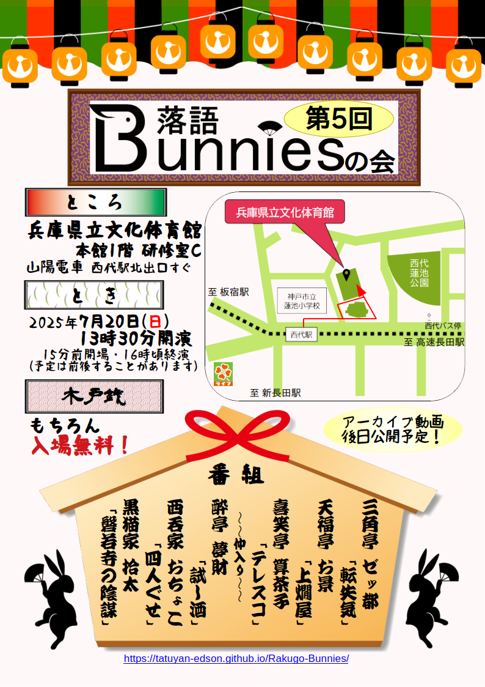

# 最新の公演情報

**無事に終演いたしました。お運びありがとうございました！**
**アーカイブは[こちらから](https://www.youtube.com/playlist?list=PLvqA8nD_0MQCEC_1xRm0PhtJOON6gpLtE)。機器不調につき1,2席目がございません、お詫び申し上げます。**

* とき：2025年7月20日(日) 13:30〜 (15分前開場)　16時頃終演予定(途中休憩あり）
* ところ：[兵庫県立文化体育館(神戸常盤アリーナ)](https://www.hyogobuntai.jp/) 本館1階 研修室C
  * 神戸高速線/山陽本線 西代駅 北口すぐ
  * JR神戸線/神戸市営地下鉄線 新長田駅 北へ徒歩約10分
* 木戸銭：もちろん*無料*
