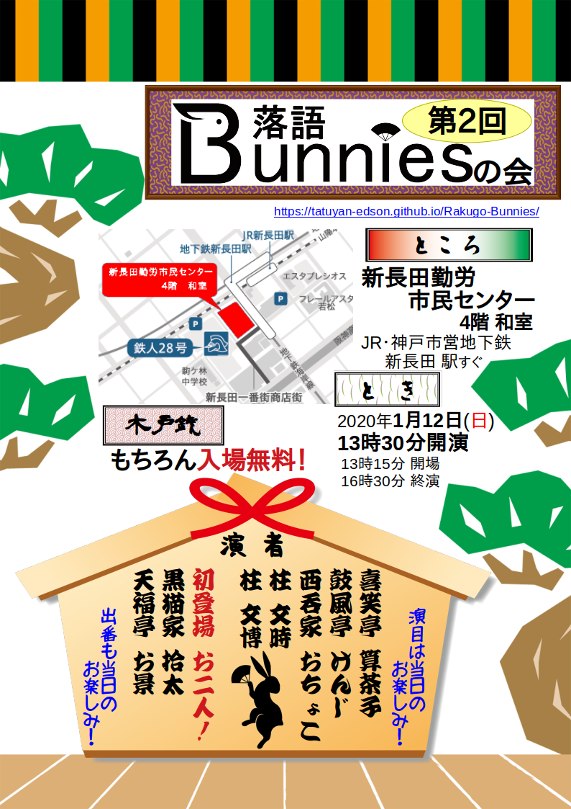

# 最新の公演情報
*10月13日 東京会場の開催は、台風の影響を鑑み、中止といたします。*

## もしもしBunnies東西交流会

東京「もしもし亭」と神戸「落語Bunnies」が交流・共演する落語会！
* とき：2019年11月3日 13:30〜 (15分前開場)　16:30頃終演予定(途中休憩あり）
* ところ：[モンプレジール](http://1988monplaisir.fun/)　(兵庫県西宮市甲子園口2丁目16番21号)
  * JR神戸線 甲子園口駅 徒歩5分
* 木戸銭：もちろん*無料*

### 出演者
* 白椿 桐ら一
* もしもし亭 のんべえ
* もしもし亭 ちゃんぽん
* 西呑家 おちょこ
* もしもし亭 わこぶ
* もしもし亭 姫楽
* 柱 文博
* もしもし亭/喜笑亭 算茶子

## 第2回落語Bunniesの会

* とき：2020年1月12日 13:30〜 (15分前開場)　16:30頃終演予定(途中休憩あり）
* ところ：[新長田勤労市民センター](https://www.kobe-kinrou.jp/shisetsu/shinnagata/)4階 和室
  * JR神戸線・神戸市営地下鉄各線 新長田駅 すぐ
* 木戸銭：もちろん*無料*
