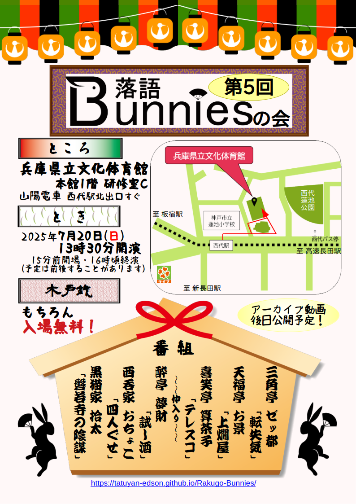

## 公演情報

* とき：2025年7月20日(日) 13:30〜 (15分前開場)　16時頃終演予定(途中休憩あり）
* ところ：[兵庫県立文化体育館(神戸常盤アリーナ)](https://www.hyogobuntai.jp/) 本館1階 研修室C
  * 神戸高速線/山陽本線 西代駅 北口すぐ
  * JR神戸線/神戸市営地下鉄線 新長田駅 北へ徒歩約10分
* 木戸銭：もちろん*無料*

## 落語バニーズって？

神戸周辺のアマチュア落語好きが集まりました！うさぎが飛び跳ねるような元気な落語、月のうさぎの餅つきのような幻想的な落語、普段のうさぎのような可愛い落語、バニーガールのような大人の落語…アマチュアながら色々な落語に挑戦する落語バニーズ、隅から隅までずずずいーっと希い奉りますm(__)m
