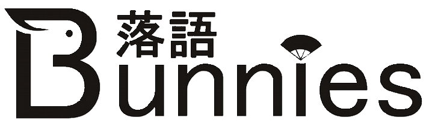
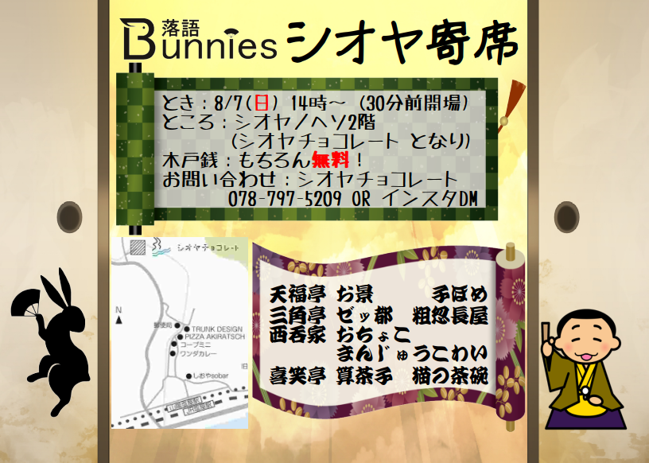

## 公演情報

久々のライブ公演！

* とき：2022年8月7日 14:00〜 
* ところ：シオヤノヘソ 2階　(地図は

## 落語バニーズって？

神戸周辺のアマチュア落語好きが集まりました！うさぎが飛び跳ねるような元気な落語、月のうさぎの餅つきのような幻想的な落語、普段のうさぎのような可愛い落語、バニーガールのような大人の落語…アマチュアながら色々な落語に挑戦する落語バニーズ、隅から隅までずずずいーっと希い奉りますm(__)m
